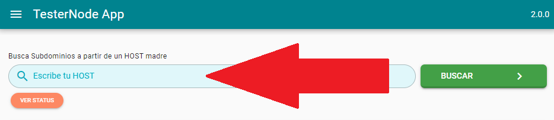
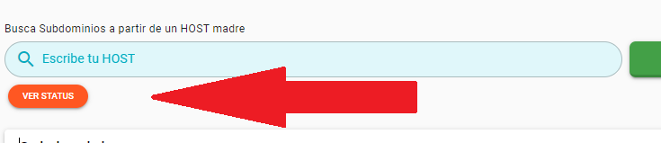

# testerNode

Herramienta para escanear posibles subdominios de un Dominio madre o Host, también realiza la prueba o test de status en cada método GET, POST, PUT, etc.

## Requisitos

1. GIT
2. NODEjs v16.17.X^
3. yarn
4. Quasar CLI
5. Token API key VirutTotal

---

## Instalación

- clonar Repositorio, entrar en carpeta e instalar paquetes

```bash
git clone https://github.com/jjjjose/testerNode.git
cd testerNode
yarn allinstall
```

- construir BUILD

```bash
yarn build
```

- ejecutar el proyecto

```bash
yarn start
```

- entrar al proyecto en `http://localhost:3030`

## Variables de entorno

poner sus datos en el archivo archivo `.env`

```env
IP_PUBLIC="XXX.XXX.XXX.XXX" #si desea montar el proyecto en un VPS o server publico puede agregar su ip, valor por default = "localhost"
PORT_PUBLIC=3030 #en caso de poner en un puerto especifico, valor por default 3030
HTTPS="false" #si quiere habilitar externamente https, puede habilitar esta opcion, valor por defecto "false"
REMOVE_PORT="false" #si desea usar Docker y reedireccionar el trafico a puerto normal, es necesario poner "true", valor por defecto "false"
VIRUSTOTAL_API_KEY="XXXXXXX" #token de virus total
```

## Modo de uso Básico

### Scan de Subdominios

- escriba el host o dominio madre para buscar subdominios...



### Test de status en metodos

- haga click al boton `ver Status`, antes debe buscar subdominios...



## LICENSE

[MIT](LICENSE)
